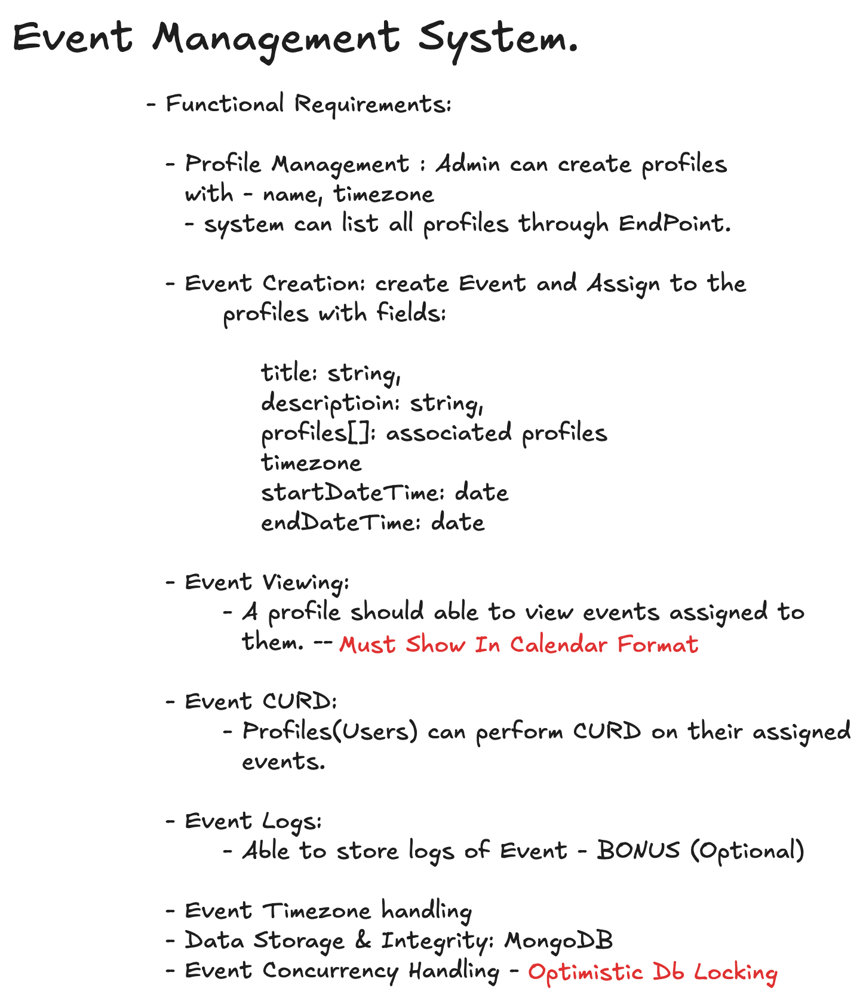
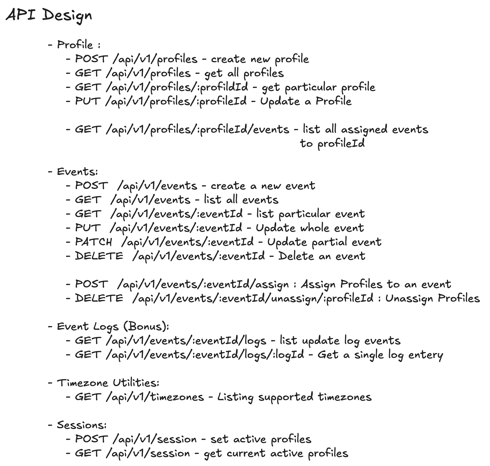
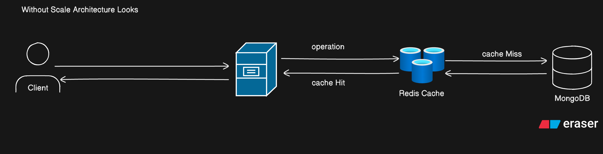
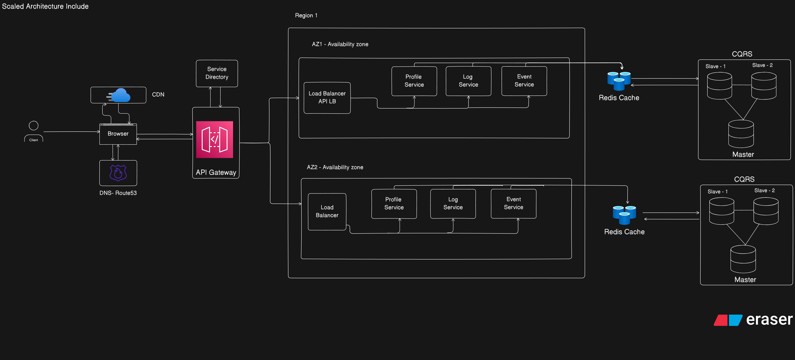
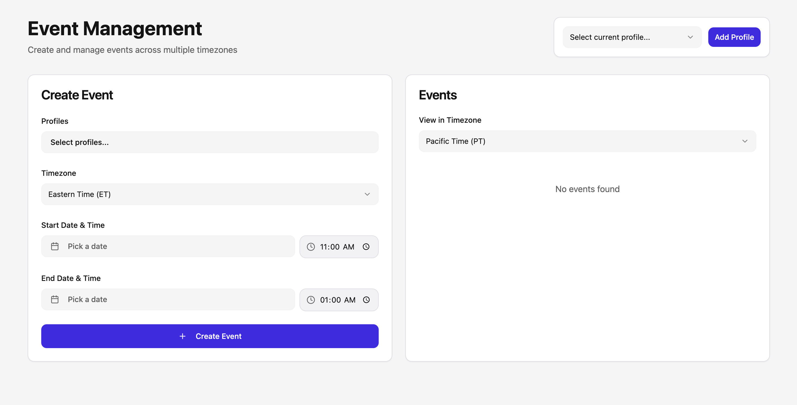
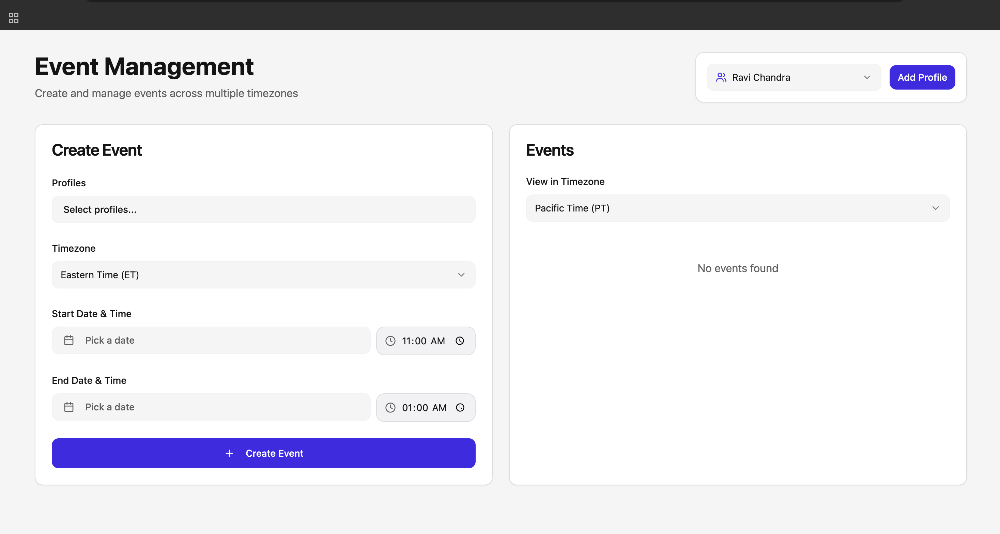
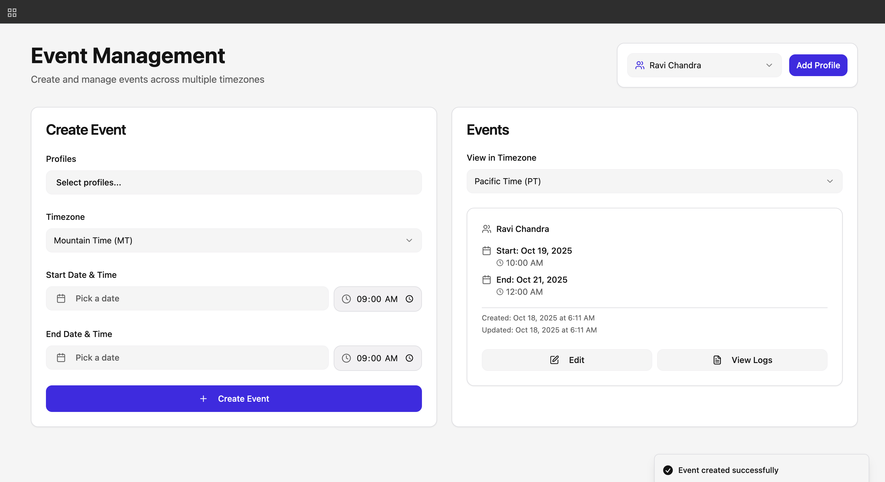
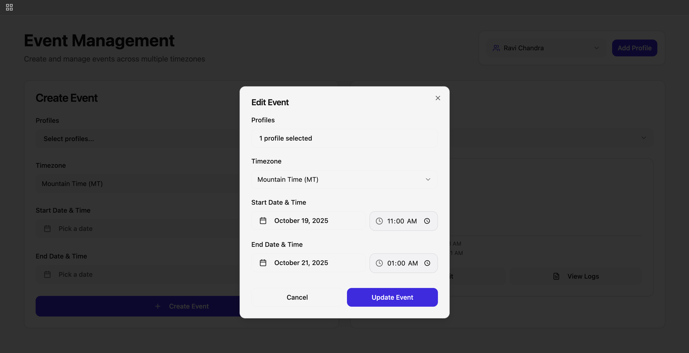
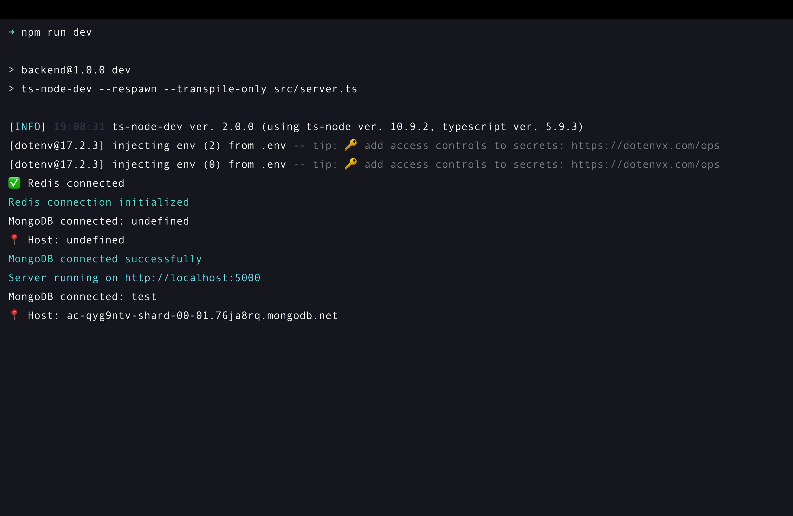

## Introduction

The **Event Management System** is a web-based platform designed to streamline the process of creating, managing, and tracking events. It enables organizations and teams to efficiently schedule events, assign them to multiple profiles, and handle timezones seamlessly.

With a responsive and user-friendly interface, the system simplifies event management by providing features such as:

- Creating, editing, and deleting events with specific start and end times.
- Assigning events to multiple profiles or participants.
- Supporting timezone-aware scheduling for global teams.
- Tracking event history and status for better management and reporting.

## This project is ideal for organizations, teams, or individuals who need a structured and scalable way to manage events across different time zones while keeping the process intuitive and accessible.

###

## Features

The Event Management System offers a comprehensive set of features to simplify event scheduling and management:

- **Event Creation & Management**:

  - Create, edit, and delete events with ease.
  - Specify start and end dates and times for each event.

- **Profile Assignment**:

  - Assign events to one or multiple profiles or participants.
  - Manage profile-specific events efficiently.

- **Timezone Support**:

  - Schedule events across different timezones.
  - Automatically handle timezone conversions for participants.

- **Event History & Tracking**:

  - Maintain a log of event updates and changes.
  - Track past and upcoming events for better organization.

- **Responsive & User-Friendly UI**:

  - Intuitive interface with modals, dropdowns, and calendar pickers.
  - Works seamlessly across desktop and mobile devices.

- **Notifications & Feedback**:

  - Provides real-time feedback on actions (success/error messages).
  - Ensures users are informed about event creation and updates.

- **Scalable Architecture**:

  - Designed to easily accommodate future features like analytics, reports, and integrations.

- **Testing**
  - Implemented Unit testing to End to End testing for system reliability.

---

## Tech Stack

The Event Management System is built using modern and reliable technologies for both frontend and backend development:

### Frontend

- **React 18** – Component-based UI library for building interactive interfaces.
- **TypeScript** – Adds type safety for scalable and maintainable code.
- **Vite** – Fast and lightweight development server and build tool.
- **Tailwind CSS** – Utility-first CSS framework for styling.
- **shadcn/ui** – Prebuilt UI components for rapid development.
- **Redux Toolkit** – State management for predictable data flow.
- **React Query (Tanstack)** – Efficient data fetching and caching.
- **Day.js** – Lightweight library for date and timezone handling.
- **Lucide Icons** – Modern icon library for UI elements.
- **Sonner** – Toast notifications for user feedback.

### Backend

- **Node.js & Express.js** – Backend server and REST API implementation.
- **MongoDB (Mongoose)** – NoSQL database for storing events and profiles.
- **Axios** – HTTP client for API requests.
- **Zod** – Runtime schema validation for requests and responses.

---

## Functional Requirements

It Include all the **Functional Requirement** of the Given Assessment based on the Event Management System.



---

## API Design

Design all the necessary required API's for this assessment task.

## 

## Client-Server Architecture

Created Simple **Client-Server** based arhitecture with **caching**, and Seperate **MongoDB** Database.

## 

## Scalable System Architecture

For the higher load handling I extend the simple architecture to **Highly-Scalable** and **Highly-Available** architecture with the **Database** Replication using **CQRS** and **Master-Salve** architecture based approach.



---

## Getting Started

Follow these steps to run the Event Management System locally on your machine.

### Prerequisites

- **Node.js** >= 18.x
- **npm** or **yarn**
- **MongoDB** (local or cloud instance)

---

### Backend Setup

1. Navigate to the backend directory:
   ```bash
   cd backend
   npm install
   ```
2. Create a .env file with the following variables:
   ```bash
   PORT=5000
   MONGO_URI=<your_mongodb_connection_string>
   JWT_SECRET=<your_jwt_secret>
   ```
3. Start the backend server:
   ```bash
   npm run dev
   ```

### Frontend Setup

1. Navigate to the frontend directory:
   ```bash
   cd frontend
   npm install
   ```
2. Create .env file with the API URL:
   ```bash
   VITE_API_BASE_URL=http://localhost:5000/api/v1
   ```
3. Start the frontend development server:

   ```bash
   npm run dev

   # The frontend should now be accessible at http://localhost:5173.
   ```

---

## Usage / Screenshots

### 1. Event Form Layout



### 2. Created Profile by Ravi Chandra name



### 3. Created Event by Ravi Chandra Profile



### 4. Updating Event layout



### 5. Backend server started


